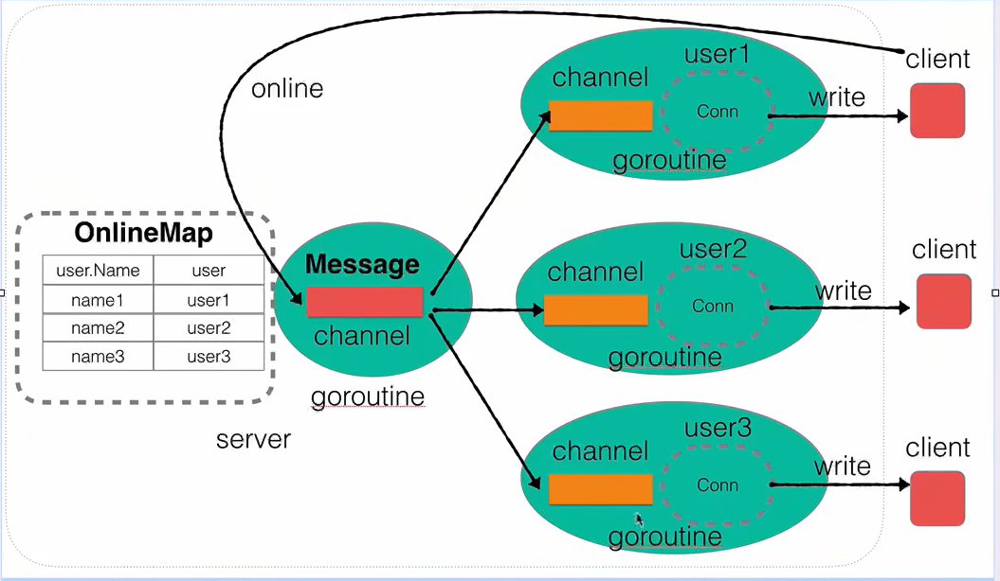

使用Go实现一个即时通信系统，学习自刘丹冰老师，b站教程视频：
https://www.bilibili.com/video/BV1gf4y1r79E

## 1.创建 Server 测试客户端连接
mac： 

`go build -o server main.go server.go`

`ns 127.0.0.1 port` 进行连接

windows：

`go run .`

`telnet 127.0.0.1 port` 进行连接

>如果telnet命令出现错误，需要在控制面板中打开telnet客户端服务，允许进行网络连接
> 
> 控制面板 -- 程序和功能 -- 启用或关闭windows功能 -- 勾选Telnet客户端

## 2.用户上线功能

server端维护了onlineMap--在线用户名单，和一个用于存放消息的channel

server端启动后，主线程阻塞

- 一旦accept成功，就启动一个协程处理连接后的业务逻辑，输出连接成功的日志，并且将该用户/连接加入onlineMap，最后向server端的channel写入消息进行广播

- 广播机制的实现：启动server端时，启动一个协程循环监听server端的channel，连接成功后，channel中就有了信息，此时该监听协程就将读取的消息发送给onlineMap中的所有用户，相应的用户端即User也要启动一个协程去监听用户端的channel，一旦有发送过来的信息就进行一个输出

>windows控制台中文乱码问题：使用命令 `chcp 65001`，在Windows中，控制台中使用的默认代码页是Windows的本地代码页(如在中国大陆常用的936)，在这个代码页中，控制台默认采用的字符集是GBK或GB2312。如果想要在控制台中正常显示UTF-8编码的中文字符，需要先设置代码页为65001，这样控制台就可以正确地解析UTF-8编码的字符了

## 3.用户消息广播功能

使用conn.Read方法进行读取数据，和上线广播机制相同，将读取到的客户端消息进行广播，这里也要启动一个协程去进行监听连接对端的消息

注意：如果是windows系统，使用 `telnet` 命令可能会出现编码错误以及每次只能接收和发送一个字符的问题
